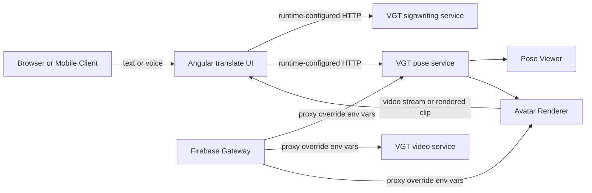

# VGT Cloud GPU Blueprint

This repository already contains the client and gateway seams needed for a VGT-specific deployment:

- Angular/Ionic client flow under `src/app/pages/translate`
- spoken-to-signed proxy routes under `functions/src/gateway`
- pose, human-video, and avatar viewers in the spoken-to-signed output pane
- avatar upload/list/delete endpoints backed by Firebase Storage

The missing piece for production VGT is not another UI rewrite. It is a dedicated backend that can replace the default hosted `sign.mt` endpoints with VGT-aware signwriting, pose, video, and avatar services.

## What This Fork Adds

- `vgt` is now exposed in the signed-language selector
- signed-language labels fall back to their IANA abbreviation, so `vgt` renders as `VGT` even without a translation file
- frontend translation calls can be overridden at runtime through `window.__SIGN_MT_CONFIG__.translationApi`
- Firebase gateway proxy targets can be overridden with environment variables
- the output pane shows an experimental status hint for `vgt` until the build is pointed at dedicated VGT infrastructure

## Recommended Service Topology



## Runtime Configuration

Inject this before the Angular bundle loads:

```html
<script>
  window.__SIGN_MT_CONFIG__ = {
    translationApi: {
      spokenTextToSignedPoseUrl: 'https://your-vgt-gpu.example.com/pose',
      spokenTextToSignedVideoUrl: 'https://your-vgt-gpu.example.com/video',
      spokenTextToSignWritingUrl: 'https://your-vgt-gpu.example.com/signwriting',
      imageToAvatarUrl: 'https://your-vgt-gpu.example.com/avatar/'
    }
  };
</script>
```

For server-side proxying in Firebase Functions:

```bash
SPOKEN_TEXT_TO_SIGNED_POSE_URL=https://your-vgt-gpu.example.com/pose
SPOKEN_TEXT_TO_SIGNED_VIDEO_URL=https://your-vgt-gpu.example.com/video
IMAGE_TO_AVATAR_URL=https://your-vgt-gpu.example.com/avatar/
```

## Practical Next Build Steps

1. Replace the default signwriting endpoint with a VGT-specific text-to-sign representation service.
2. Point the pose route at a cloud GPU service that returns either pose JSON or a playable animation asset for VGT.
3. Decide whether the avatar path returns rendered video directly or whether the client should keep using the 3D and human-video viewers.
4. Add regression tests around the chosen VGT contract before training-model work starts, so the repo can fail fast when the backend schema changes.

## Why This Matters

The existing repository is already strong at presentation, offline/browser translation experiments, and viewer composition. VGT needs backend specialization and configurable routing much more urgently than it needs another frontend rewrite.
